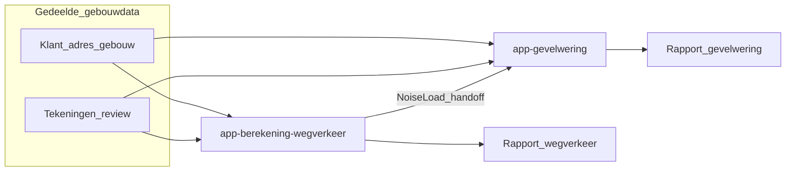

# app-gevelwering — overzicht

**Status:** Productontwerp + implementatie (GA / plattegrond / materialen)  
**Repo:** `c/app-gevelwering`  
**Zusterapp:** [app-berekening-wegverkeer](../../../app-berekening-wegverkeer/docs/architecture/app-berekening-wegverkeer-overview.md) (verkeerslawaai → `NoiseLoad[]`)  
**Detailontwerp:** [facade-sound-insulation-app.md](facade-sound-insulation-app.md)  
**PostgreSQL DDL:** [app-gevelwering-postgres-schema.md](app-gevelwering-postgres-schema.md)  
**Runtime:** [bppServer server-runtime-rfc](../../../bppServer/docs/Architectural_aspects/09-bppserver/server-runtime-rfc.md)  
**Deploy:** [`client/docs/secure-deployment.md`](../../client/docs/secure-deployment.md)

---

## 1. Doel

**app-gevelwering** berekent de **geluidwering van de gevel** (GA / Lbi / GA;k e.d.) voor een nieuw of bestaand verblijf, als aparte consultant-app op bppServer.

| Uitkomst | Beschrijving |
|----------|--------------|
| Gevelwering | Per verblijfsruimte (VR) / verblijfsgebied (VG), op basis van plattegrond, gevelvlakken en materialen |
| Beoordeling | Toetsing vs. toepasselijke grenswaarden (jurisdictietabel) |
| Rapport | Berekening + bijlagen (later PDF) |

Dit is **niet** de verkeerslawaai-app. Verkeersbelastingen komen bij voorkeur als **`NoiseLoad[]`** van **app-berekening-wegverkeer**, of via import/handmatige invoer voor demo’s.

---

## 2. Relatie met de zusterapp

| Soort data | Eigenaar |
|------------|----------|
| Klant, adres, gebouw, tekeningen, review | Gedeeld (Postgres `app_gevelwering` schema / building record) |
| Wegen, verkeer, Laeq-model, verkeersrapport | **app-berekening-wegverkeer** |
| `NoiseLoad[]` | Handoff-artefact (wegverkeer → gevelwering) |
| Plattegrond VG/VR, gevelcomponenten, materialen, GA-resultaten | **app-gevelwering** |

---

## 3. Productgrenzen (deze app)

**In scope**

- Engineer/admin UI: tekeningen, plattegrond, gevels, materialencatalogus, GA-model  
- VG / VR / vlakken, schaal + oppervlakten, **compositie (+/−)** van gevelcomponenten  
- Materialen: DGMR-catalogus (`catalogusGG.pdf`) + **eigen materialen** (`source = eigen`)  
- Berekening gevelwering (NPR/NEN-route zoals geïmplementeerd), toets Lbi;k ≤ 33 dB  
- Consumeren van `NoiseLoad[]` (of import)

**Niet in scope**

- Wegselectie, verkeersintensiteiten, Laeq-motor (→ zusterapp)  
- Automatisch “lezen” van PDF/CAD voor afmetingen (v1: consultant + tekeningtools)  
- Coding-agent / LLM-tooling  
- Aparte taxonomie-rubriek “custom” — eigen materialen horen in de bestaande GG-rubriek/subrubriek

---

## 4. Huidige stack

| Onderdeel | Locatie |
|-----------|---------|
| Map / start | `c/app-gevelwering/./start.sh` |
| UI | `client/` — o.a. `/ga.html`, `/floormap.html`, `/materials.html`, `/engineer.html` |
| Postgres | Database + schema **`app_gevelwering`** |
| Fixtures | `fixtures/app-gevelwering/*.basicpp` |

---

## 5. Workflow (huidige implementatie)

Procesdiagram: [`docs/workflow gevelweringgevels-app.drawio`](../workflow%20gevelweringgevels-app.drawio) (open in diagrams.net / draw.io).

1. Gebouw/project openen (gedeelde building data).  
2. Tekeningen registreren / engineer-review (`/engineer.html`).  
3. Plattegrond (`FLOORMAP`): VG/VR-ruimten tekenen, schaal, opslaan; volgorde in de lijst met **Omhoog/Omlaag**.  
4. Geveltekening: componenten tekenen → **materiaal toekennen** → eventueel **compositie (+/−)** → GA (componentvolgorde eveneens Omhoog/Omlaag).  
5. `NoiseLoad[]` van wegverkeer-app (of import / handmatig).  
6. GA-berekening per VR (`/ga.html`); toets Lbi;k; resultaten bewaren / rapporteren (later PDF).

Detailontwerp (historisch + invokes): [facade-sound-insulation-app.md](facade-sound-insulation-app.md).

### 5.1 Materiaaltoekenning (gevel)

| Stap | Waar | Wat |
|------|------|-----|
| Catalogus beheren | `/materials.html` (admin) of via **Materiaalcatalogus…** op de gevel | CRUD op `app_gevelwering.material`; filter **Bron → Eigen materialen** |
| Eigen materiaal | `/floormap.html` (gevel) → **Eigen materiaal…** | `POST /api/floormap/materials` → `source = eigen`, catalog-id `E#####`; selectie in de materiaalkiezer |
| Toekennen op component | `/floormap.html` (gevel) | Rubriek → subrubriek → materiaal; filter «Alleen eigen materialen» optioneel |
| Opslaan enkele contour | **Component opslaan** | Schrijft materiaal + geometrie op **het actieve** (bewerkte) component |
| GA vlakkentoekenning | `/ga.html` | Alleen **lezen** van materiaal op de gekozen gevelcomponent; geen catalogus/eigen-materiaal hier |

**Belangrijk:** materiaal hoort bij de **componentdefinitie**, niet bij de GA-vlakstap. De materiaalkiezer is gedeeld op de geveltekening. **Component opslaan** koppelt materiaal aan het contour dat je bewerkt — niet automatisch aan de compositie. Voor een compositieresultaat: materiaal kiezen → **Toepassen & opslaan** (zie §5.2).

Catalogusrijen hebben `source = catalogusGG.pdf` (of legacy `GL.cat`). Eigen rijen: `source = eigen` (ook bij handmatige ids zoals `P00002`). Bij `./start.sh` wist de catalogus-seed **alleen** `catalogusGG.pdf` / `GL.cat`; rubriek-assign slaat eigen rijen over.

### 5.2 Compositie (+/−) op de gevel

Doel: meerdere gesloten contouren combineren tot één netto oppervlak met één materiaal (bijv. omhulling minus kozijnen = metselwerk).

1. Teken en sla de broncomponenten op (bijv. slaapkamer-omhulling, kozijn L, kozijn R) — materiaal op bronnen is optioneel.  
2. Selecteer ≥2 gesloten componenten in de lijst.  
3. **Grootste oppervlak = buitencontour (+)**; overige moeten **volledig binnen** die ring liggen.  
4. Zet per deel **+** (meenemen) of **−** (aftrekken).  
5. Kies het materiaal voor het **resultaat** in de materiaalkiezer.  
6. Klik **Toepassen & opslaan** (niet «Component opslaan»).  
7. Selectie blijft staan → volgende compositie met ander materiaal kan op dezelfde buitencontour.

Resultaat: `boolean_op: "compose"`, `outer_subsection_id`, `constituent_signs`, `source_subsection_ids`, eventuele holes. Netto = ∪(+) − ∪(−). Bronnen met hetzelfde materiaal (of zonder) worden bij herschrijven vervangen; andere materialen blijven beschikbaar voor een volgende compositie.

Feedback (succes/fout) staat onder de compositieknoppen (`fm-compose-feedback`).

### 5.3 Van gevel naar GA

- Gevelcomponenten met VR + materiaal voeden vlakken / Stot in de GA-UI.  
- Composities tellen als één geveldeel; broncontouren van die compositie niet dubbel meenemen.  
- Na verse berekening: Lbi;k = Lb − GA;k; **Voldoet** als Lbi;k ≤ 33 dB.

---

## 6. Fasering (deze app)

| Fase | Focus |
|------|--------|
| **P0–P1** | Building + docs; UI; mock loads |
| **P2–P3** | Plattegrond/gevel tooling; echte isolatieformules |
| **P4** | Rapportpakket gevelwering |
| **P5** | Duurzame handoff van `NoiseLoad[]` over sessies |

Zusterapp-fasering: zie [app-berekening-wegverkeer-overview.md](../../../app-berekening-wegverkeer/docs/architecture/app-berekening-wegverkeer-overview.md).

---

## 7. Volgende stap

Doorgaan met productrijping in deze repo (GA, plattegrond, materialen) en de handoff-API met **app-berekening-wegverkeer** vastleggen zodra die app een eigen repo/startpad heeft.

Schema / APIs: [app-gevelwering-postgres-schema.md](app-gevelwering-postgres-schema.md).
