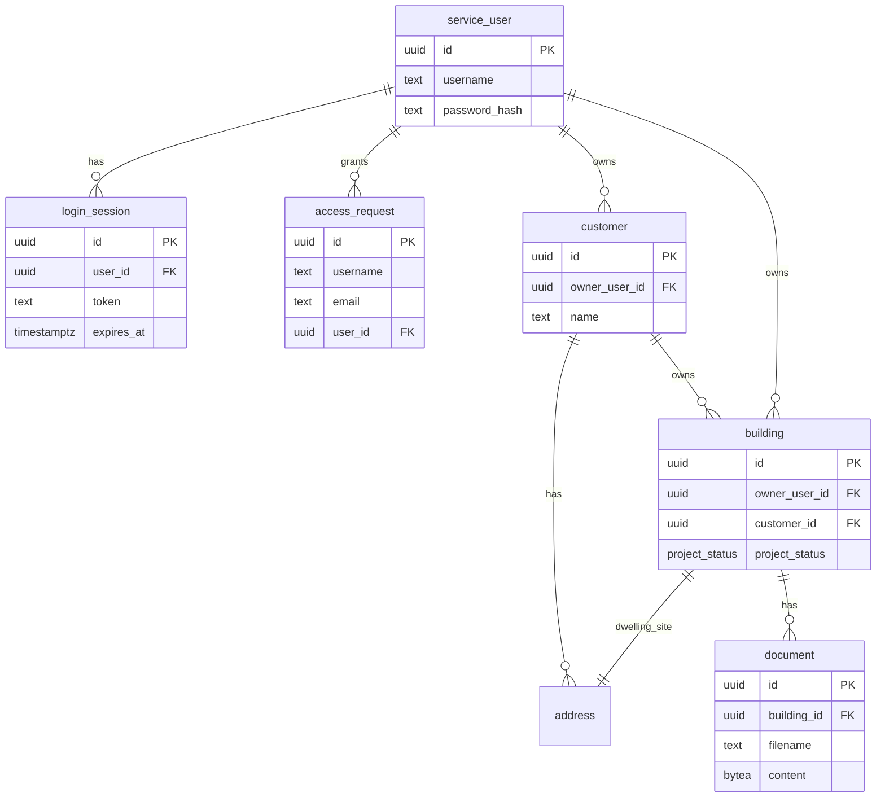

# Acoustics apps — PostgreSQL schema (DDL)

**Status:** Design DDL for shared building store (Acoustics apps + bppServer Postgres)  
**Related:** [app-gevelwering-overview.md](app-gevelwering-overview.md), [server-runtime-rfc.md](../../../bppServer/docs/Architectural_aspects/09-bppserver/server-runtime-rfc.md) §2.5  
**Store:** PostgreSQL  
**Not in scope:** coding-agent / LLM tooling

---

## Versioning

This DDL **will change**. Treat the header below as authoritative for the current design snapshot.

| Field | Value |
|-------|--------|
| **DDL version** | **0.2.27** |
| **Date** | 2026-08-01 |
| **Scope** | … + multi-variant: `verblijfsruimte.variant_id`, UNIQUE `(variant_id, subsection_id)`, clone/compare APIs |
| **Breaking?** | Yes for VR uniqueness (was global `UNIQUE(subsection_id)`; now per variant) |

**Rules:**

1. Bump **DDL version** on every schema change (SemVer-ish: major = breaking rename/drop; minor = additive tables/columns; patch = comments/indexes/docs-only).
2. Append a row to [§ Revision history](#revision-history) — do not rewrite old versions in place.
3. When implementing migrations in this app repo, name files to match (e.g. `sql/app_gevelwering_0_2_0.sql`).
4. App docs that depend on columns should cite **DDL version**, not only “latest”.

---

## Current scope (0.2.25)

| In scope | Out of scope (later DDL versions) |
|----------|-----------------------------------|
| `service_user` (login) | `aoi` / GIS extracts |
| `login_session` (persisted tokens) | `noise_load` (App 1 → App 2) |
| `access_request` (registration audit) | App 1 traffic load spectra |
| `customer` / `address` / `building` | Spectral R′ / spectrum weighting in GA kernel |
| One `customer` row per `service_user` (`owner_user_id` unique) | Shared-geometry refactor (VG under building) |
| `building` = client **project** (one dwelling per project) | |
| `building.project_status` (incl. `PROJECT_FINISHED`) | |
| `document` blobs per project (pdf, dwg) | |
| `drawing_review` / `drawing_region` / `drawing_subsection` | |
| `material` — catalogusGG.pdf façade catalog + R spectra | |
| `variant` / `verblijfsgebied` / `verblijfsruimte` / `vlak` / `vlak_element` | |
| Multi-variant: `VR.variant_id`, unique room **per variant**, clone/compare APIs | |
| Delete guard: project removable only in `INITIAL_REQUEST` | |
| Seed users `demo`, `ronheusdens`, `admin` | |

---

## ER sketch



---

## Auth flow (client)

1. User opens form URL → **login** (username / password).  
2. `API_Login` checks `service_user.password_hash` (`pgcrypto` `crypt`) and inserts `login_session` (token, 12h expiry).  
3. Browser persists token (`localStorage`); building form unlocks.  
4. `API_SaveBuildingEntry` / `API_OpenBuilding` require a valid token; rows get `owner_user_id`.
5. Client sees `building.project_status`; admin updates it on a dedicated admin page.

**P0 accounts:** `ronheusdens` / `demo`; `demo` / `demo`; `admin` / `demo`.

---

## DDL files

| File | Version |
|------|---------|
| `sql/app_gevelwering_0_1_0.sql` | Base: customer, address, building |
| `sql/app_gevelwering_0_2_0.sql` | Auth tables + `owner_user_id` + demo user |
| `sql/app_gevelwering_0_2_1.sql` | Seed `ronheusdens`; claim NULL-owner rows |
| `sql/app_gevelwering_0_2_2.sql` | Registration email + `must_change_password` + `access_request` |
| `sql/app_gevelwering_0_2_3.sql` | `project_status` on building + seed `admin` |
| `sql/app_gevelwering_0_2_4.sql` | Add `PROJECT_FINISHED` to `project_status` enum |
| `sql/app_gevelwering_0_2_5.sql` | One customer per owner; project delete guards + dwelling cleanup |
| `sql/app_gevelwering_0_2_6.sql` | `document` table — pdf/dwg blobs per project |
| `sql/app_gevelwering_0_2_12.sql` | `material` catalog (GL.cat); seed `app_gevelwering_0_2_12_gl_material_seed.sql` |
| `sql/app_gevelwering_0_2_16.sql` | GA model: `variant` → VG → VR → `vlak` → `vlak_element` |
| `sql/app_gevelwering_0_2_25.sql` | Multi-variant: `verblijfsruimte.variant_id`; UNIQUE `(variant_id, subsection_id)` |
| `sql/app_gevelwering_0_2_27.sql` | `vlak.orientatie` (N/NO/O/ZO/Z/ZW/W/NW) — basis Lb→CL |

### 0.2.0 (additive)

```sql
CREATE EXTENSION IF NOT EXISTS pgcrypto;

CREATE TABLE app_gevelwering.service_user (
  id              uuid PRIMARY KEY DEFAULT gen_random_uuid(),
  username        text NOT NULL UNIQUE,
  password_hash   text NOT NULL,
  display_name    text,
  is_active       boolean NOT NULL DEFAULT true,
  created_at      timestamptz NOT NULL DEFAULT now(),
  updated_at      timestamptz NOT NULL DEFAULT now()
);

CREATE TABLE app_gevelwering.login_session (
  id              uuid PRIMARY KEY DEFAULT gen_random_uuid(),
  user_id         uuid NOT NULL REFERENCES app_gevelwering.service_user (id) ON DELETE CASCADE,
  token           text NOT NULL UNIQUE,
  created_at      timestamptz NOT NULL DEFAULT now(),
  expires_at      timestamptz NOT NULL,
  revoked_at      timestamptz
);

ALTER TABLE app_gevelwering.customer
  ADD COLUMN owner_user_id uuid REFERENCES app_gevelwering.service_user (id) ON DELETE SET NULL;

ALTER TABLE app_gevelwering.building
  ADD COLUMN owner_user_id uuid REFERENCES app_gevelwering.service_user (id) ON DELETE SET NULL;
```

(Full idempotent script: `sql/app_gevelwering_0_2_0.sql`.)

### Client entry mapping (after login)

| Client field | Table / column |
|--------------|----------------|
| Login username / password | `service_user` (+ `login_session.token`) |
| Access request username / email | `access_request`, `service_user` |
| Customer name, email, phone | `customer` (+ `owner_user_id`) |
| Addresses | `address` |
| Building label / external ref / client-visible project stage | `building` (+ `owner_user_id`, `project_status`) |

### Invoke mapping (P0)

| Invoke | DB effect |
|--------|-----------|
| `API_Bootstrap` | Connect PG |
| `API_Login(user$, pass$)` | verify hash → create `login_session` → return token JSON |
| `API_ValidateSession(token$)` | check session still valid |
| `API_Logout(token$)` | revoke session |
| `API_RequestAccess(user$, email$, display$)` | create service user + access-request row |
| `API_ChangePassword(token$, current$, new$)` | rotate password, clear first-login flag |
| `API_GetCustomerProfile(token$)` | load customer profile for owner |
| `API_SaveCustomerProfile(token$, …)` | upsert customer profile + billing address |
| `API_ListBuildings(token$)` | list outstanding projects for owner (excludes `PROJECT_FINISHED`) |
| `API_SaveBuildingEntry(token$, …, building_id$)` | upsert customer profile; create or update project |
| `API_OpenBuilding(token$, id$)` | load project for owner |
| `API_DeleteProject(token$, building_id$)` | delete project when `INITIAL_REQUEST` (customer) |
| `API_EngineerListProjects(token$)` | engineer/admin: all non-finished projects (Bestand → Openen) |
| `API_RenameProject(token$, building_id$, label$, external_ref$)` | engineer/admin: rename label/werknummer (any status) |
| `API_EngineerDeleteProject(token$, building_id$)` | engineer/admin: delete project (any status; UI cleans `data/projecten/`) |
| `API_ListProjectDocuments(token$, building_id$)` | list drawing metadata for a project |
| `API_UploadDrawingChunk(token$, …)` | legacy chunked base64 upload (superseded by HTTP API below) |
| `API_DeleteDrawing(token$, document_id$)` | delete drawing when project is `INITIAL_REQUEST` |
| `API_CustomerSubmitDrawings(token$, building_id$)` | customer submits uploaded drawings → `PROJECT_DATA_SUPPLIED_NOT_YET_PROCESSED` |
| `API_EngineerListReviewQueue(token$)` | engineer queue (projects with drawings awaiting/under review) |
| `API_EngineerGetProject(token$, building_id$)` | engineer project detail + documents + regions + review |
| `API_ReviewDrawings(token$, building_id$, sufficient$, legible$, notes$)` | engineer review; if sufficient+legible → `PROJECT_UNDERWAY` |
| `API_ListDrawingRegions(token$, document_id$)` | list normalized crop regions for a drawing |
| `API_SaveDrawingRegion(token$, document_id$, page_index$, label$, region_kind$, x_min$, y_min$, x_max$, y_max$, region_id$)` | engineer upsert region (empty `region_id` = insert) |
| `API_DeleteDrawingRegion(token$, region_id$)` | engineer delete region |
| `API_AdminListCustomers(token$)` | admin-only customer list with outstanding + drawing counts |
| `API_AdminListCustomerProjects(token$, customer_id$)` | admin-only all projects for one customer |
| `API_AdminUpdateProjectStatus(token$, building$, status$)` | admin-only update of `building.project_status` |
| `API_AdminListAccounts(token$)` | admin-only opdrachtgever logins (`service_user`, niet engineer/admin) + optioneel `customer` |
| `API_AdminUpdateAccount(token$, user_id$, display_name$, email$, is_active$)` | admin-only: weergavenaam, e-mail, actief; geen username/rol |
| `API_AdminResetAccountPassword(token$, user_id$)` | admin-only: tijdelijk wachtwoord + `must_change_password` |
| `API_AdminListMaterials(token$, q$, category$, limit$, offset$, source_filter$)` | admin material catalog search (paginated); `source_filter$` = `eigen` \| `catalogus` \| empty |
| `API_AdminGetMaterial(token$, material_id$)` | admin load one material |
| `API_AdminSaveMaterial(token$, …)` | admin insert/update material + R spectrum |
| `API_AdminDeleteMaterial(token$, material_id$)` | admin delete material |
| `API_ListVariants` / `API_SaveVariant` / `API_DeleteVariant` | engineer: berekeningsvarianten per building |
| `API_CloneVariant(token$, source_variant_id$, omschrijving$)` | engineer: deep copy variant + VG/VR/vlak/element (zelfde subsection_ids) |
| `API_CompareVariants(token$, building_id$, variant_ids_csv$)` | engineer: platte VR-resultaten voor multi-variant vergelijking |
| `API_ListVerblijfsgebieden` / `API_CreateVerblijfsgebied` / `API_SaveVerblijfsgebied` / `API_DeleteVerblijfsgebied` | engineer: VG (create = VG+eerste VR + floormap subsection; uniqueness subsection **per variant**) |
| `API_ListVerblijfsruimten` / `API_AddVerblijfsruimte` / `API_SaveVerblijfsruimte` / `API_DeleteVerblijfsruimte` / `API_SaveVerblijfsruimteResults` | engineer: VR (+ persist GA/Lbi/GA;k); laatste VR niet verwijderbaar |
| `API_ListVlakken` / `API_SaveVlak` / `API_DeleteVlak` | engineer: gevelvlakken |
| `API_ListVlakElementen` / `API_SaveVlakElement` / `API_DeleteVlakElement` | engineer: elementen ↔ `material` |
| `API_ListLinkedSubsections(token$, building_id$)` | engineer: floormap subsection → VR-koppelingen (inclusief `variant_id`) |

**P0 client:** `client/` — landing **http://127.0.0.1:4173/** · opdrachtgever **http://127.0.0.1:4173/opdrachtgever.html** (`./start.sh`).  
**Admin page:** **http://127.0.0.1:4173/admin.html** (restricted in UI and API to `admin`) — opdrachtgever-accounts inzien/bewerken + projectstatus + link naar materiaalcatalogus.  
**Engineer page:** **http://127.0.0.1:4173/engineer.html** (restricted to `engineer` / `is_engineer` accounts).

### HTTP drawing upload (P1 — production path)

Browser uploads **raw file bytes** to the UI server (not WebSocket). The server validates the bppServer session token against PostgreSQL and inserts one row into `app_gevelwering.document` with a parameterized `bytea` bind.

```
POST /api/drawings/upload?building_id=<uuid>&filename=<name.pdf>
Authorization: Bearer <session_token>
Content-Type: application/octet-stream

<body: raw pdf or dwg bytes>
```

| Response | Meaning |
|----------|---------|
| `201` `{ ok, document_id, byte_size, … }` | Stored |
| `401` | Invalid/expired session |
| `403` | Project not in `INITIAL_REQUEST` |
| `413` | Exceeds `GEVELWERING_MAX_UPLOAD_BYTES` (default 100 MiB) |

Implementation: `client/lib/drawing-upload.mjs` (uses `pg`, same `BPP_PG_CONN` as bppServer).

WebSocket `API_UploadDrawingChunk` remains for compatibility but is no longer used by the P0/P1 browser client.

```
GET /api/drawings/download?document_id=<uuid>
Authorization: Bearer <session_token>
```

Returns raw PDF/DWG bytes. Allowed for project owner, `admin`, or `is_engineer` users.

### DDL 0.2.7 — engineer review

| Table / column | Purpose |
|----------------|---------|
| `service_user.is_engineer` | engineer role flag |
| `drawing_review` | one review row per building (sufficient, legible, notes) |
| `drawing_region` | normalized (0–1) crop rectangles per document page |

Demo account: `engineer` / `demo`.

### DDL 0.2.9 — section analysis objects

Identified sections are first-class objects for later geometry work (area, circumference, subsections).

| Object | Storage | Notes |
|--------|---------|--------|
| Section object | `app_gevelwering.drawing_region` (+ view `app_gevelwering.drawing_section`) | One row per accepted/saved section |
| Normalized bbox | `x_min..y_max` | Page-relative 0–1 |
| Area / perimeter | `area_norm`, `perimeter_norm` | Axis-aligned box metrics in page units; scale after calibration |
| Lifecycle | `analysis_status` | `DRAFT` → `READY_FOR_ANALYSIS` on **Save review** |
| Extensibility | `analysis` jsonb | Future subsections + calculation payloads |
| Review link | `review_id`, `committed_at` | Set when engineer saves the review |

`API_ReviewDrawings` requires ≥1 saved section, then commits all project sections and returns `section_count` + per-section `area_norm` / `perimeter_norm`.

### DDL 0.2.10 — floormap room subsections

Engineer-only room geometry on committed `FLOORMAP` sections (customer progress stays at drawings accepted / calculation underway).

| Object | Storage | Notes |
|--------|---------|--------|
| Room / subsection | `app_gevelwering.drawing_subsection` | Closed polyline in **section-local** 0–1 coords (`points` jsonb) |
| Parent scale | `drawing_region.scale_ratio`, `metres_per_norm_unit`, `scale_source` | `NONE` \| `PDF_TEXT` \| `CALIBRATED` |
| Metrics | `area_norm`, `perimeter_norm`, `area_m2`, `perimeter_m` | m² / m filled when scale is set; recomputed on scale save |
| Room scale | `drawing_subsection.metres_per_norm_unit` | Snapshot of scale applied with the room (0.2.11); edits can reuse without recalibration |
| Lifecycle | `analysis_status` | `DRAFT` \| `READY_FOR_ANALYSIS` \| `ANALYZED` |
| Level hint | `level_hint` | `GROUND` \| `FIRST` \| … \| `OTHER` |

APIs: Basic++ `API_ListFloormapSections`, `API_SaveFloormapScale`; HTTP `/api/floormap/*` for section list, subsection CRUD (JSON polylines), scale + room recompute, materials list/create, and **`POST /api/floormap/subsections/reorder`** (`section_id` + `ordered_ids`) for persistent list order via `drawing_subsection.sort_order`. UI: `/floormap.html` — rooms on `FLOORMAP`; façade components + **compositie (+/−)** on elevation regions; ▲/▼ in the saved-components list. Material/compose workflow: [overview §5](app-gevelwering-overview.md#5-workflow-huidige-implementatie).

### DDL 0.2.12+ — material catalog (catalogusGG + eigen)

Shared reference catalog for façade sound reduction. Primary seed: DGMR **catalogusGG.pdf** (`source = 'catalogusGG.pdf'`). Legacy GL.cat seed may still run earlier in `./start.sh`.

| Object | Storage | Notes |
|--------|---------|--------|
| Material | `app_gevelwering.material` | Catalog + engineer rows |
| Identity | `(source, catalog_id)` unique; also `catalog_index` / `material_no` | Catalog ids `D#####`; eigen ids `E#####` |
| Source | `source` | `catalogusGG.pdf` \| `GL.cat` \| **`eigen`** |
| Taxonomy | `rubriek_nr` 1–9, `subrubriek_nr`, `master_category`, `category` | GG taxonomy (`material-taxonomy.mjs`); no separate “custom” rubriek |
| Spectrum | `r_63_hz` … `r_4000_hz`, `ra_dba`, `rw_db` / `c_db` / `ctr_db` | Octave-band R + single-number ratings |

**Seed safety:** `sql/app_gevelwering_0_2_14_catalogus_gg_seed.sql` deletes only `source IN ('catalogusGG.pdf','GL.cat')` — eigen and other non-catalog rows (e.g. `P#####`) are kept. Rubriek assign (`0_2_21_assign_rubriek.py`) skips `source = eigen`. Admin save forces `source = eigen` for new rows and for catalog ids that are not DGMR `D#####`.

**Admin CRUD UI:** `/materials.html` — `API_AdminListMaterials(…, source_filter$)` with `eigen` \| `catalogus` \| empty; badge for eigen rows. New materials default `source = eigen`.

**Engineer assignment:** façade pick list `GET /api/floormap/materials`; create eigen `POST /api/floormap/materials` from `/floormap.html` (not GA); bind via subsection `analysis.material_id` / compose apply. GA vlak UI shows material read-only. Workflow: [overview §5](app-gevelwering-overview.md#5-workflow-huidige-implementatie).

### DDL 0.2.25 — multi-variant (clone / compare)

Same floormap room may appear in multiple berekeningsvarianten. Geometry tree is **deep-cloned** per variant (not shared).

| Object | Change |
|--------|--------|
| `verblijfsruimte.variant_id` | Denormalized FK → `variant` (NOT NULL); backfilled from parent VG |
| Uniqueness | Dropped global `UNIQUE(subsection_id)`; added `UNIQUE (variant_id, subsection_id)` |
| Create / Add VR | API checks subsection unused **within the target variant** only |
| `API_CloneVariant` | Copies variant row + all VG → VR → vlak → vlak_element (new UUIDs; same `subsection_id` / façade / materials) |
| `API_CompareVariants` | Flat rows for UI compare table; match rooms across variants by `subsection_id` |
| `API_ListLinkedSubsections` | Each link includes `variant_id` (GA UI scopes “free rooms” to the active variant) |

Product workflow: [overview §5.4](app-gevelwering-overview.md#54-varianten-multi-scenario).

---

## Revision history

| DDL version | Date | Changes |
|-------------|------|---------|
| **0.1.0** | 2026-07-20 | Initial: schema `acoustics`; `customer`, `address`, `building`; enums `address_kind`, `building_status` |
| **0.2.0** | 2026-07-20 | `service_user`, `login_session`; `owner_user_id` on customer/building; pgcrypto; demo user `demo`/`demo` |
| **0.2.1** | 2026-07-20 | Seed `ronheusdens`/`demo`; assign NULL-owner customer/building rows to that user |
| **0.2.2** | 2026-07-21 | `service_user.email`; `must_change_password`; `access_request`; first-login password rotation support |
| **0.2.3** | 2026-07-21 | `building.project_status`; admin-only project queue/status updates; seed `admin`/`demo` |
| **0.2.4** | 2026-07-21 | Add `PROJECT_FINISHED`; admin UI selects customer then lists all projects |
| **0.2.5** | 2026-07-21 | Unique customer per login; multi-project customer UI; delete only in `INITIAL_REQUEST` |
| **0.2.6** | 2026-07-21 | `document` blobs (pdf/dwg) per project; admin drawing visibility |
| **0.2.7** | 2026-07-21 | `is_engineer`; `drawing_review`; `drawing_region`; engineer UI + review APIs |
| **0.2.8** | 2026-07-21 | `drawing_region` kinds: add `FLOORMAP`, `CROSS_SECTION` |
| **0.2.9** | 2026-07-21 | Section analysis objects: norms, `READY_FOR_ANALYSIS`, view `drawing_section`; review commits sections |
| **0.2.10** | 2026-07-21 | `drawing_subsection` rooms; floormap scale columns; floormap workspace + APIs |
| **0.2.11** | 2026-07-21 | `drawing_subsection.metres_per_norm_unit` — per-room scale snapshot |
| **0.2.12** | 2026-07-22 | `material` catalog from GL.cat; R spectra 125–4000 Hz; seed 3618 rows |
| **0.2.13** | 2026-07-22 | Set `material.category = 'glas'` when `name ILIKE '%glas%'` |
| **0.2.14** | 2026-07-22 | Rebuild `material` from `catalogusGG.pdf`: `master_category`, dikte/gewicht/RA/bron, R63–2000, supplier fields |
| **0.2.15** | 2026-07-22 | Retag false `category=glas` (non-Glas masters) → `Elementen`; keep `master_category` Glas intact |
| **0.2.16** | 2026-07-22 | GA nieuwbouw-model: `variant`, `verblijfsgebied`, `verblijfsruimte` (↔ floormap subsection), `vlak`, `vlak_element`; engineer CRUD APIs |
| **0.2.25** | 2026-08-01 | Multi-variant: `verblijfsruimte.variant_id`; UNIQUE `(variant_id, subsection_id)`; `API_CloneVariant`, `API_CompareVariants` |
| **0.2.27** | 2026-08-02 | `vlak.orientatie` (kompascodes); List/Save/Clone + GA-UI + rapport |
