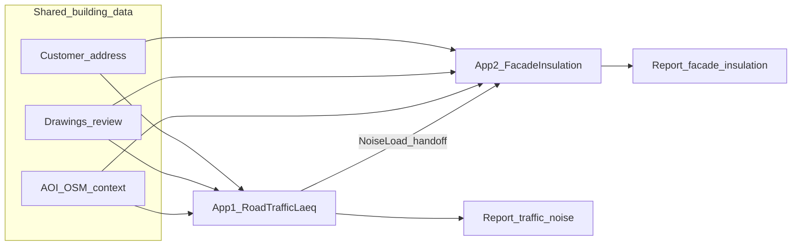

# Two acoustics apps overview (Laeq + façade insulation)

**Status:** Design driver for Acoustics apps on bppServer  
**Related:** [server-runtime-rfc.md](../../../bppServer/docs/Architectural_aspects/09-bppserver/server-runtime-rfc.md) §2.5, sibling `c/bppServer`  
**Apps (distinct):** [road-traffic-noise-app.md](road-traffic-noise-app.md) (App 1), [facade-sound-insulation-app.md](facade-sound-insulation-app.md) (App 2)  
**PostgreSQL DDL:** [app-gevelwering-postgres-schema.md](app-gevelwering-postgres-schema.md) (**versioned** — through **0.2.11**)  
**Secure www deploy:** [`client/docs/secure-deployment.md`](../../client/docs/secure-deployment.md) (HTTPS/WSS via Apache)  
**Not in scope:** coding-agent / LLM tooling (basic++ `09-agent-integration`)

---

## 1. Purpose

**Two distinct applications** (separate products, separate Basic++ programs, separate reports). App 2 **consumes App 1 noise results** via a structured handoff — that is **not** a merge into one app.

| App | Name | Outcome |
|-----|------|---------|
| **App 1** | Road traffic noise assessment | Time-equivalent sound level (**Laeq**) at the dwelling from road traffic; limit check; traffic-noise report |
| **App 2** | Façade sound insulation | Insulation of the new façade vs App 1 noise loads; limit check; insulation report |

**Data model:**

1. **Shared building data** — entered once, read by both apps: customer, new dwelling address, site/floor/construction drawings, review gate, and (when used) site AOI / OSM context for the same building.
2. **App 1 → App 2 handoff** — structured **`NoiseLoad[]`** (Laeq / related metrics at façades or receivers). Not building master data; calculation output from App 1.
3. **App-specific data** — App 1: roads, traffic, ground/model, traffic report. App 2: façade sections, materials, insulation calc, insulation report.


---

## 2. Shared building data

**Authoritative for the dwelling** and used by both apps (same project store / durable DB later):

| Shared building data | System |
|----------------------|--------|
| Customer details + new dwelling address | `SetCustomer` / `SetProjectSite` |
| Site layout, floor plans, construction drawings | Session cwd + `RegisterDocument` |
| Drawing sufficiency gate | `ReviewDrawings` |
| Site AOI / OSM vector context (roads, nearby buildings) | `SetAOI` / `ExtractOsm…` (shared when both apps need vicinity maps) |
| bppServer project binding | Both apps resolve the same `project_id` / building record |

Shared domain objects: `Project`, `Customer`, `SiteAddress`, `Document[]`, `ReviewGate`, and optionally `AOI` / `GisExtract` for that building.

**Persistence:** PostgreSQL — see **[app-gevelwering-postgres-schema.md](app-gevelwering-postgres-schema.md)** (DDL **0.1.0**: `customer`, `address`, `building`). Bump that doc’s DDL version on every schema change.

**Not shared as building master data** (app-owned or handoff):

| Owned by | Data |
|----------|------|
| App 1 | Selected roads, traffic tables, ground/elevations for noise model, traffic assessment, traffic report |
| App 1 → App 2 | `NoiseLoad[]` (handoff artifact) |
| App 2 | Façade sections, materials, insulation results, insulation report |

Each app remains independently invocable for demos (App 2 with imported loads), but the **normal permit path** shares one building record.---

## 3. App responsibilities

| | **App 1 — Road traffic → Laeq** | **App 2 — Façade insulation** |
|--|----------------------------------|-------------------------------|
| **Goal** | Laeq / noise loads at façades or receivers from selected roads | Insulation of new façade vs those loads |
| **GIS focus** | Road selection; import buildings, ground/elevations, roads | Vicinity context; sections consultant-measured |
| **Inputs** | Traffic intensities, composition, daily distribution | Sections, materials, **NoiseLoad[] from App 1** |
| **Outputs** | Laeq metrics, traffic limit assessment, model appendix | Insulation results, insulation limit assessment, drawing/load/result appendices |
| **Doc** | [road-traffic-noise-app.md](road-traffic-noise-app.md) | [facade-sound-insulation-app.md](facade-sound-insulation-app.md) |

---

## 4. Handoff contract: `NoiseLoad` (App 1 → App 2)

App 1 must publish **structured** loads (JSON / project tables / later DB), not only a human report. Building master data is **not** re-copied in this handoff — both apps already share the building record (§2).

### Minimal schema (v1 sketch)

```text
NoiseLoad {
  project_id$
  receiver_id$          ' façade id or receiver point id
  receiver_kind$        ' FACADE | POINT
  metric$               ' LAEQ_DAY | LAEQ_EVENING | LAEQ_NIGHT | LDEN | …
  value#                ' dB
  unit$                 ' dB
  period$               ' optional label
  source_app$           ' ROAD_TRAFFIC
  method$               ' jurisdiction / method id
  calculated_at$        ' ISO timestamp
}
```

Rules:

- App 2 **prefers** project `NoiseLoad[]` from App 1.
- Manual `SetNoiseLoads` remains available for demos or when App 1 was run externally (import JSON).
- Changing App 1 results invalidates App 2 assessment until recompute.

### Example invoke return (App 1)

```json
{
  "loads": [
    { "receiver_id": "facade-N", "receiver_kind": "FACADE", "metric": "LDEN", "value": 58.2, "unit": "dB" },
    { "receiver_id": "facade-E", "receiver_kind": "FACADE", "metric": "LDEN", "value": 52.0, "unit": "dB" }
  ],
  "assessment": { "limit_metric": "LDEN", "limit_value": 53.0, "pass": false }
}
```

---

## 5. Distinct apps — session sketches (bppServer)

Two programs: `road_traffic_noise_app.basicpp` and `facade_sound_insulation_app.basicpp`. Typical path = **separate sessions** on the **same building/project**, plus `NoiseLoad[]` handoff. Demo path may run App 1 then App 2 in one child with two `exec.request` retains.

### App 1 session

```
session.open
exec.request  { retain:true, code|file: road_traffic_noise_app.basicpp }

invoke OpenBuilding(project_id$)          ' or create + SetCustomer / SetProjectSite
invoke RegisterDocument(...) × N          ' shared building drawings
invoke ReviewDrawings(...) / SetAOI(...) / ExtractOsm(...)
invoke SelectRoads(...) / SetTrafficData(...) / ImportGround(...)
invoke RunTrafficNoise()                  ' → NoiseLoad[] on building/project
invoke AssessTrafficLimits() / ReportTraffic()

session.close                             ' child _exit; building data persists (P5+)
```

### App 2 session (same building; loads from App 1)

```
session.open
exec.request  { retain:true, code|file: facade_sound_insulation_app.basicpp }

invoke OpenBuilding(project_id$)          ' shared building data — no re-entry
invoke UpsertSection(...) × N / SetSectionMaterial(...) × N
invoke UseProjectNoiseLoads()             ' or ImportNoiseLoads(json$)
invoke ComputeInsulation() / AssessFacadeLimits() / ReportFacade()

session.close
```

Concurrent sessions: **&lt; 3** ([server-runtime-rfc.md](../../../bppServer/docs/Architectural_aspects/09-bppserver/server-runtime-rfc.md) §5.0).
---

## 6. Defaults (v1)

| Topic | Default |
|-------|---------|
| Jurisdiction / method | Single hardcoded national profile (replaceable table later) |
| Reports | HTML/Markdown + JSON summary first; PDF later |
| Persistence | **PostgreSQL from P0** for customer/address/building (DDL 0.1.0); calc handoff durability from P5 |
| Ground / elevations | Consultant CSV/manual in v1; DEM auto-import later |
| P0 client | HTML + TypeScript simple forms for shared building fields |

---

## 7. Phased delivery (both apps)

| Phase | Focus |
|-------|--------|
| **P0** | DDL 0.1.0 + persist customer/address/building; **HTML/TypeScript client** UI for those fields; mock App1 Laeq + `NoiseLoad[]`; mock App2 insulation/report |
| **P1** | Documents/review + App1 road select / traffic tables (manual) |
| **P2** | Real OSM roads/buildings (+ ground if available) for App1 model |
| **P3** | Real traffic-noise + façade-insulation formulas (each in its own app) |
| **P4** | Both report packs |
| **P5** | Broader durable store so App1→App2 handoff can span days/sessions |

---

## 8. Next step

Implement **P0**:

1. Apply [app-gevelwering-postgres-schema.md](app-gevelwering-postgres-schema.md) **DDL 0.1.0** and wire `SetCustomer` / `SetProjectSite` / `OpenBuilding` (or equivalent) to Postgres via bppServer.
2. Ship a **simple HTML + TypeScript client** UI for the customer, address, and building fields; verify save + reload.
3. Add fixtures `road_traffic_noise_app.basicpp` and `facade_sound_insulation_app.basicpp` with mock Laeq / insulation as before.