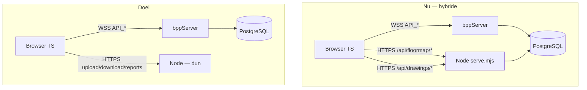

# Migratieplan — Node REST → bppServer (WSS)

**Status:** Plan (aug 2026)  
**Doel:** Maximaal gebruik van bppServer-logica; één PostgreSQL-pad via Basic++; productie blijft **HTTPS/WSS achter Apache** op loopback-backends.  
**Gerelateerd:** [app-gevelwering-overview.md](app-gevelwering-overview.md) · [secure-deployment.md](../../client/docs/secure-deployment.md) · [app-gevelwering-postgres-schema.md](app-gevelwering-postgres-schema.md)

---

## 1. Uitgangspunten

| Principe | Keuze |
|----------|--------|
| Transport naar bppServer | **WSS** `wss://<host>/ws` (Apache → `127.0.0.1:18080`) |
| Transport naar Node | **HTTPS** alleen voor static, binary I/O, PDF |
| PostgreSQL | **Alleen via bppServer** voor domeinlogica; Node `pg`-pool uitfaseren voor CRUD |
| Auth | Blijft `login_session` + token; elke `API_*` valideert sessie server-side |
| Productie | `BPP_WS_ORIGIN_ALLOWLIST`, `GEVELWERING_REQUIRE_HTTPS=1`, backends op loopback, HSTS/CSP |

**Niet in scope van deze migratie**

- Rapport-PDF (`report-api.mjs`, Puppeteer)
- Raw tekening **download** (HTTP streaming blijft praktisch)
- GA-rekenkern verplaatsen naar server (optionele fase 5)
- HttpOnly-cookie → WS-gateway (fase 6, hardening)

---

## 2. Huidige vs doelsituatie



---

## 3. Inventarisatie

### 3.1 Al in bppServer — frontend gebruikt nog Node

| bppServer (bestaat) | Node REST (nu) | Frontend |
|---------------------|----------------|----------|
| `API_ListFloormapSections` | `GET /api/floormap/sections` | `floormap.ts`, `ga.ts` |
| `API_SaveFloormapScale` | `POST /api/floormap/scale` | `floormap.ts`, `engineer.ts` (+ WS fallback) |
| `API_ListDrawingRegions` | — (deels REST delete) | `engineer.ts` (regions via WS save) |
| `API_SaveDrawingRegion` | — | `engineer.ts` ✅ |
| `API_DeleteDrawingRegion` | `DELETE /api/drawings/sections` | `engineer.ts` |
| `API_ListProjectDocuments` | `GET /api/drawings/list` | `app.ts` |
| `API_UploadDrawingChunk` | `POST /api/drawings/upload` | `app.ts` (binary) |
| `API_DeleteDrawing` | — | `app.ts` ✅ |

### 3.2 Alleen in Node — bpp-kandidaat (nieuw bouwen)

| Node REST | Voorgestelde bpp API | Complexiteit |
|-----------|---------------------|--------------|
| `GET /api/floormap/section` | `API_GetFloormapSection` | Laag |
| `GET/POST/DELETE /api/floormap/subsections` | `API_List/Save/DeleteDrawingSubsection` | **Hoog** (~400 regels save-logica) |
| `POST /api/floormap/subsections/reorder` | `API_ReorderDrawingSubsections` | Laag |
| `POST /api/floormap/subsection-material` | `API_SaveSubsectionMaterial` | Middel |
| `GET /api/floormap/vr-components` | `API_ListVrFacadeComponents` | Middel (port `ga-vr-components`) |
| `GET/POST /api/floormap/materials` | `API_ListMaterials` / `API_CreateMaterial` | Middel (overlap admin) |
| `GET /api/floormap/material-categories` | `API_ListMaterialCategories` | Laag |
| `GET /api/floormap/material-alternatives` | `API_ListMaterialAlternatives` | Laag |
| `GET/POST/DELETE /api/floormap/material-favorites` | `API_*MaterialFavorites` | Laag |
| `GET/POST /api/floormap/material-favorite-presets` | `API_*MaterialFavoritePresets` | Laag |

### 3.3 Blijft op Node (HTTPS)

| Endpoint | Reden |
|----------|--------|
| `GET /api/drawings/download` | Binary PDF-stream; geen winst via WS |
| `POST /api/drawings/upload` | Raw octet-stream (efficiënter dan base64-chunks) — *optioneel* later ook bpp |
| `/api/reports/*` | Filesystem + Puppeteer |
| `/api/session` | HttpOnly cookie helper |
| Static `/`, `*.js`, `*.css` | UI-host |

---

## 4. Gedeelde frontend-infrastructuur (vóór fase 1)

Voordat endpoints één voor één migreren, één dunne laag in TS:

**Nieuw bestand:** `client/src/bpp-api.ts`

```typescript
// parseJsonOk + invokeString wrapper
export async function bppCall<T>(send, invokeString, name: string, args: unknown[]): Promise<T>
```

- JSON parse + uniforme `ERROR:` handling
- Typedefs per response (`sections`, `subsections`, …)
- Geen businesslogica — alleen transport

**Acceptatie:** bestaande schermen blijven werken; alleen import-pad wijzigt waar nodig.

---

## 5. Migratiefasen

### Fase 0 — Voorbereiding (1–2 dagen)

**Doel:** Veilig migreren zonder regressie.

| Stap | Actie |
|------|--------|
| 0.1 | Feature-flag env `GEVELWERING_USE_BPP_FLOORMAP=0|1` (default 0) per endpoint-groep |
| 0.2 | `bpp-api.ts` + smoke-test script (login → `API_ListFloormapSections`) |
| 0.3 | Documenteer handmatige testchecklist per scherm (floormap, engineer, ga, opdrachtgever) |
| 0.4 | Staging: Apache + WSS checklist uit [secure-deployment.md](../../client/docs/secure-deployment.md) verifiëren |

**Apache (geen wijziging):** `/ws` vóór catch-all `/`; `proxy_wstunnel` enabled.

---

### Fase 1 — Quick wins: bestaande bpp API’s aansluiten (2–4 dagen)

Geen nieuwe Basic++; alleen frontend + Node deprecate.

| # | bpp invoke | Vervangt | Bestanden |
|---|------------|----------|-----------|
| 1.1 | `API_ListFloormapSections` | `GET /api/floormap/sections` | `floormap.ts`, `ga.ts` |
| 1.2 | `API_SaveFloormapScale` | `POST /api/floormap/scale` | `floormap.ts`, `engineer.ts` (HTTP-pad verwijderen) |
| 1.3 | `API_DeleteDrawingRegion` | `DELETE /api/drawings/sections` | `engineer.ts` |
| 1.4 | `API_ListProjectDocuments` | `GET /api/drawings/list` | `app.ts` |

**Per endpoint:**

1. TS: `bppCall` i.p.v. `apiGet`/`fetch`
2. Response-mapping controleren (veldnamen bpp ↔ Node JSON)
3. Flag `GEVELWERING_USE_BPP_*=1` in staging
4. Node handler: `@deprecated` comment + 410 na 1 release *of* proxy naar bpp (niet aanbevolen — dubbel pad)

**Acceptatiecriteria**

- [ ] Plattegrond: sectielijst + schaal kalibreren + opslaan
- [ ] Engineer: region verwijderen
- [ ] Opdrachtgever: tekeningenlijst
- [ ] Geen regressie op GA (sections alleen voor plattegrond-koppeling)

**Rollback:** flag terug naar 0.

---

### Fase 2 — Subsections CRUD (1–2 weken) — kern ✅ (aug 2026)

**Doel:** Grootste Node→PG pad (`floormap-api.mjs` ~700–1100) naar bpp.

**SQL:** `sql/app_gevelwering_0_2_30.sql` — geometry helpers + `fw_*` functies (list/get/save/delete/reorder).

**Nieuwe procedures in `shared_building_api.basicpp`:**

| Procedure | Parameters (indicatief) | Status |
|-----------|-------------------------|--------|
| `API_ListDrawingSubsections` | `session_token`, `section_id` | ✅ |
| `API_GetFloormapSection` | `session_token`, `section_id` | ✅ |
| `API_SaveDrawingSubsection` | `session_token`, `payload_json` | ✅ |
| `API_DeleteDrawingSubsection` | `session_token`, `subsection_id` | ✅ |
| `API_ReorderDrawingSubsections` | `session_token`, `section_id`, `ordered_ids_csv` | ✅ |

**Frontend:** `bpp-api.ts` + `floormap.ts`, `ga.ts` (subsection list). Rollback: `localStorage.setItem('GEVELWERING_BPP_HTTP','1')`.

**Deploy:** SQL 0.2.30 toepassen vóór bppServer herstart; daarna fixture `INCLUDE` herladen.

**Acceptatiecriteria**

- [ ] Teken/opslaan/dupliceer/compositie op gevel
- [ ] Kierdichting + materiaal koppelen
- [ ] Lijst volgorde ▲/▼
- [ ] GA: expected_orientaties nog correct uit plattegrond

**Node:** handlers `@deprecated`; verwijderen na staging-validatie.

---

### Fase 3 — VR-gevelcomponenten voor GA (3–5 dagen) ✅ (aug 2026)

| Procedure | Port van | Status |
|-----------|----------|--------|
| `API_ListVrFacadeComponents` | `handleFloormapVrComponentsList` + `partitionVrGaComponents` | ✅ |

**SQL:** `sql/app_gevelwering_0_2_31.sql` — `fw_list_vr_facade_components` (+ GA filter helpers).

**Frontend:** `ga.ts` → `bppListVrFacadeComponents`. Client `ga-vr-components.ts` blijft voor floormap UI (lokaal filter); server is bron voor GA vlakken-kiezer.

**Acceptatie:** GA vlakken-kiezer toont zelfde componenten; geen dubbele compositie-bronnen.

---

### Fase 4 — Materialen & favorieten (1 week) ✅ (aug 2026)

| Node | bpp | Status |
|------|-----|--------|
| `material-categories` | `API_ListMaterialCategories` | ✅ |
| `materials` GET/POST | `API_ListMaterials` / `API_CreateMaterial` | ✅ |
| `material-alternatives` | `API_ListMaterialAlternatives` | ✅ |
| `material-favorites` | `API_List/Add/RemoveMaterialFavorite` | ✅ |
| `material-favorite-presets` | `API_ListMaterialFavoritePresets` / `API_MaterialFavoritePresetAction` | ✅ |
| `subsection-material` | `API_SaveSubsectionMaterial` | ✅ |

**SQL:** `sql/app_gevelwering_0_2_32.sql`

**Frontend:** `floormap.ts`, `materials.ts`, `ga.ts` — rollback via `GEVELWERING_BPP_HTTP=1`.

**Opmerking:** Admin-catalogus blijft `API_Admin*` (bestaand). Engineer pick-list/favorites gebruiken de nieuwe procedures.

#### Fase 4b — Afronding (nog open; geen nieuwe features)

Implementatie is klaar; dit is alleen validatie + opruimen. **Geen apart bouwplan meer nodig** tenzij acceptatie faalt.

| # | Actie | Done wanneer |
|---|--------|--------------|
| 4b.1 | bppServer herstarten na SQL 0.2.32 + fixture reload | `API_ListMaterialCategories` bereikbaar via WSS |
| 4b.2 | Handmatige checklist (zie hieronder) op staging | Alle items afgevinkt |
| 4b.3 | Network tab: geen `/api/floormap/material*` of `subsection-material` (tenzij rollback-flag) | Alleen `wss://…/ws` |
| 4b.4 | ~~Node handlers → 410~~ | ✅ `GEVELWERING_BPP_ONLY=1` (default in `start.sh`) |
| 4b.5 | ~~Archiveren floormap/favorites HTTP~~ | ✅ `client/lib/deprecated/` + lazy-load in `serve.mjs` |

**`GEVELWERING_BPP_ONLY`**

| Waarde | Gedrag |
|--------|--------|
| `1` (default via `start.sh`) | Gemigreerde paden → **410 Gone**; `lib/deprecated/*` niet geladen |
| `0` | HTTP-fallback via `lib/deprecated/` (voor client `GEVELWERING_BPP_HTTP=1`) |

Upload/download/reports/session blijven altijd op Node.

**Smoke:** `scripts/smoke-bpp-phase4b.sh` (SQL + optioneel 410-curl als UI draait).

**Acceptatiechecklist fase 4** (handmatig, 4b.2–4b.3)

- [ ] Floormap: rubriek → subrubriek → materiaallijst + filter `q`
- [ ] Floormap: favoriet toevoegen/verwijderen; preset opslaan/toepassen
- [ ] Floormap: materiaal op bewerkend gevelcomponent (`subsection-material`)
- [ ] GA: Analyseer → alternatieven met hogere RA → Pas toe
- [ ] Materials-scherm: favoriet-checkbox + presets rename/delete
- [ ] Rollback: `localStorage.setItem('GEVELWERING_BPP_HTTP','1')` herstelt HTTP

**Bekende non-issues**

- `API_CreateMaterial` is gemigreerd maar weinig/geen UI-call in floormap (admin gebruikt `API_AdminSaveMaterial`) — bewust behouden voor parity met Node.
- Lijst met alleen `q` (zonder `master_category`) werkt in bpp (kier-fallback); Node eiste vroeger altijd `master_category`.

---

### Fase 5 — Optioneel: GA-berekening server-side

**Nu:** `ga-calc.ts` in browser → resultaten via `API_SaveVerblijfsruimteResults`.

**Optioneel:** `API_ComputeVerblijfsruimteGa` in `ga_model_api.basicpp`

| Pro | Con |
|-----|-----|
| Eén rekenkern, reproduceerbaar, audit | Grote port TS → Basic++ |
| Geen manipulatie in browser | Meer WS-payload per klik |

**Advies:** pas na fase 1–4; niet blokkerend voor bpp-maximalisatie.

---

### Fase 6 — Optioneel: auth-hardening

**Doel:** Minder XSS-risico op WS-token.

| Optie | Beschrijving |
|-------|--------------|
| A | Node `/api/bpp/invoke` proxy: HttpOnly cookie → server roept bpp aan (geen token in JS) |
| B | bppServer: cookie-validatie op WS handshake upgrade |

Documenteer keuze in `secure-deployment.md` na POC.

---

## 6. Node-opruiming (eindstaat)

Na fase 4 mag `serve.mjs` alleen nog:

```
/api/session
/api/drawings/upload
/api/drawings/download
/api/reports/*
static files
```

**Verwijderen / archiveren:**

- ~~`client/lib/floormap-api.mjs`~~ → `client/lib/deprecated/floormap-api.mjs` ✅
- ~~`client/lib/material-favorites-api.mjs`~~ → `client/lib/deprecated/material-favorites-api.mjs` ✅
- `pg`-queries in drawing-upload behouden *alleen* voor upload-validatie (sessie check) — overweeg delegate naar `API_ValidateSession` via lokale bpp-bridge later

**`package.json`:** `pg` dependency blijft zolang upload/report sessie-check direct SQL doet; einddoel: minimaliseren.

---

## 7. Testplan per fase

| Laag | Wat |
|------|-----|
| Handmatig | Checklist: login engineer → floormap → gevel compositie → GA vlak → rapport concept |
| Contract | JSON fixtures: request/response pairs Node vs bpp (diff moet leeg) |
| Staging | Alleen `wss://` + `https://` in Network tab |
| Security | Origin allowlist reject; direct `:18080` refused; demo passwords rotated |

**Regression hotspots**

- Schaal herberekening `area_m2` na scale change
- Compositie superseded sources in GA
- Multi-variant: subsection uniek per variant

---

## 8. Apache / productie-checklist (elke release)

```bash
# Modules
a2enmod ssl headers proxy proxy_http proxy_wstunnel rewrite

# Env (systemd / Apache SetEnv)
BPP_WS_ORIGIN_ALLOWLIST=https://jouw-domein.nl
GEVELWERING_CORS_ORIGIN=https://jouw-domein.nl
GEVELWERING_REQUIRE_HTTPS=1

# Bind
bppServer --server --port 18080   # 127.0.0.1 only
GEVELWERING_UI_HOST=127.0.0.1 GEVELWERING_UI_PORT=4173 node serve.mjs

# Firewall: deny 18080, 4173 from WAN
```

**Post-deploy verify**

1. `curl -I https://jouw-domein.nl/` → HSTS header
2. Browser: WS naar `wss://jouw-domein.nl/ws` → 101 Switching Protocols
3. Foreign Origin WS → rejected
4. Floormap save → geen calls naar `/api/floormap/subsections` (na fase 2)

---

## 9. Risico’s en mitigatie

| Risico | Mitigatie |
|--------|-----------|
| Payload-grootte subsections (JSON points) | WS message limit testen; evt. chunking in bpp |
| Basic++ portfout vs Node | Contract tests + parallel run met flag |
| Lang WS idle (Apache timeout) | `timeout=3600` in ProxyPass; client reconnect + `API_ValidateSession` |
| Upload blijft HTTP | Bewust; documenteer als enige binary-uitzondering |
| bppServer herstart nodig na fixture change | `INCLUDE` + exec in dev; prod deploy procedure |

---

## 10. Tijdinschatting (indicatief)

| Fase | Inspanning |
|------|------------|
| 0 Voorbereiding | 1–2 d |
| 1 Quick wins | 2–4 d |
| 2 Subsections | 8–12 d |
| 3 VR components | 3–5 d |
| 4 Materialen | 5–7 d |
| 5 GA server (opt.) | 10–15 d |
| 6 Auth hardening (opt.) | 5–8 d |

**Totaal tot productiedoel (fase 1–4):** ~4–6 weken focused work.

---

## 11. Volgorde samengevat

```
Fase 0 ──► Fase 1 (sections, scale, documents list, region delete)
              │
              ▼
           Fase 2 (subsections CRUD)  ◄── kritisch pad
              │
              ├──► Fase 3 (vr-components)
              │
              └──► Fase 4 (materialen + favorites)
                        │
                        ▼
                   Node pg-CRUD weg
                        │
            [opt] Fase 5 GA calc │ Fase 6 cookie gateway
```

---

## 12. Eerste concrete tickets (fase 0 + 1)

1. ~~**`client/src/bpp-api.ts`** — shared invoke + JSON parse~~ ✅
2. ~~**`floormap.ts`** — `loadFloormapSections` → `API_ListFloormapSections`~~ ✅
3. ~~Scale → `API_SaveFloormapScale` (HTTP fallback via `GEVELWERING_BPP_HTTP=1`)~~ ✅
4. ~~**`engineer.ts`** — region delete → `API_DeleteDrawingRegion`~~ ✅
5. ~~**`app.ts`** — document list → `API_ListProjectDocuments`~~ ✅
6. ~~**`ga.ts`** — sections list in `loadGeometryOptions`~~ ✅
7. Staging checklist in PR template
8. Node handlers marked `@deprecated` (rollback: `localStorage.setItem('GEVELWERING_BPP_HTTP','1')`)

**Fase 2 (subsections CRUD):**

9. ~~**`sql/app_gevelwering_0_2_30.sql`** — PG functies voor save/list/delete/reorder~~ ✅
10. ~~**`shared_building_api.basicpp`** — `API_*DrawingSubsection*`~~ ✅
11. ~~**`bpp-api.ts` + `floormap.ts` + `ga.ts`** — subsections via WSS~~ ✅
12. SQL 0.2.30 op staging/productie + handmatige acceptatiechecklist

**Rollback:** in browser console: `localStorage.setItem('GEVELWERING_BPP_HTTP','1')` en pagina herladen.

---

*Laatste update: aug 2026 — afstemmen met [app-gevelwering-overview.md §4](app-gevelwering-overview.md) stack-tabel na afronding fase 2.*
